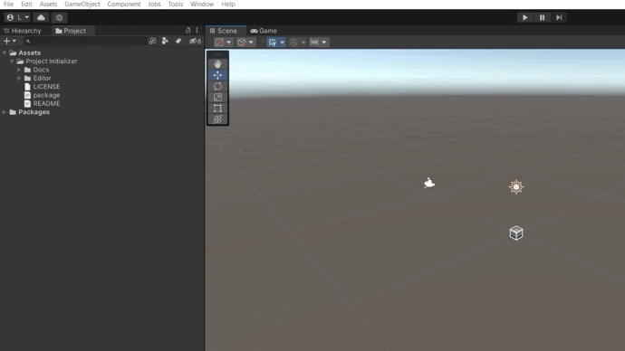

# Unity project initializer

A tool for an easy start of a unity project

## Folder structure creation

To create the basic folder structure of the project, you need:
1. Open the `Tools/Project Initializer/Create Folders` window
2. Select Folder Data
3. Click `Generate` button

The folder structure is presented in the form of a scriptable object, if desired, you can create your own structure `Assets/Create/Project Initializer/Folder Structure`.